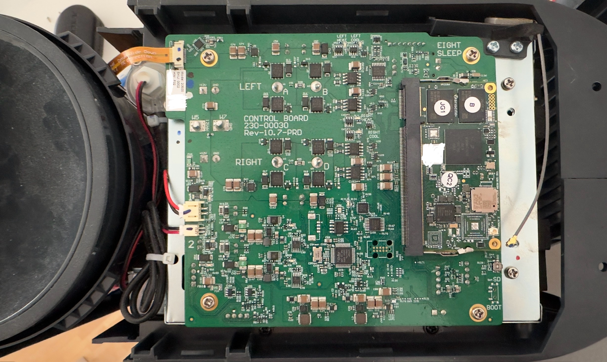

# Overview

**Warning**: This code is very new and immature. It works for me but requires technical know-how to use.

This repository contains a program intended to replace the `dac` process on an Eight Sleep Pod 3, giving the user the ability to interact with the pod locally, without any interaction with Eight Sleep's servers.

Clearly, this project is not endorsed by Eight Sleep. You're responsible for anything you do with your pod.

# Compatibility

This has currently only been tested on a Pod 3 based on the [Variscite VAR-SOM-MX8M-MINI](https://www.variscite.com/product/system-on-module-som/cortex-a53-krait/var-som-mx8m-mini-nxp-i-mx8m-mini/).

Example board: 



Example hardware info from Eight Sleep app: 


# Instructions

To use:
- Power off your pod
- Remove the fan grille on the back of the Pod 3
- Unscrew the two screws at the top that hold on the top panel
- Pry the top plastic up, you'll reach a point where you can see clips holding the top panel to the side panels, stop here
- Remove the fabric mesh panel on the front of the device. There are two clips near the top that hook onto the plastic side panels. You can push these with a screwdriver.
- Unclip the clips near the top of the cylinder that holds the water supply and pull off the top panel. You should now have access to the logic board.
- There's a little daughterboard that looks like it's plugged into a RAM slot. Remove the screws from this board, and the antenna.
- Gently pull the board up, away from the thermal putty.
- Pull the board out.
- Remove the glue from the MicroSD slot that has been revealed
- Remove the MicroSD card from the slot
- Modify the rootfs.tar.gz file located at `/opt/images/Yocto/rootfs.tar.gz` on the first partition of the MicroSD card.
    - Set the root password in `/etc/shadow`
    - Add a `NetworkManager` configuration file at `/etc/NetworkManager/system-connections/<something>.nmconnection`
    - Add your SSH key to `/etc/ssh/authorized_keys` (optionally, remove Eight Sleep's key while you're there)
- Insert the MicroSD card
- Insert the logic daughterboard
- Reattach the antenna
- Hold the smaller button on the back of the pod, next to the power cable. While the button is held in, plug the power in.
- After a few seconds, you should see the pod's light flash green. This indicates the device is performing a factory reset, using the `rootfs.tar.gz` file.
- Eventually it'll stop flashing green and connect to wifi. You should now be able to ssh into your device using the account `rewt`. You can also log in as `root` by logging in as `rewt`, typing `su` and entering the root password.

You can now compile this program for the Pod 3: `cargo build --target aarch64-unknown-linux-musl` (musl is used so that a static binary will work). Copy it to your Pod over ssh and you should be able to run it, although you'll need to run `systemctl stop dac` as root first to shut down the stock `dac`, which listens on the relevant unix socket.

You may want to disable Eight Sleep's updates and telemetry. You can do that with: `systemctl disable --now swupdate-progress swupdate defibrillator eight-kernel telegraf vector`. The `frankenfirmware` binary will still send data to `raw-api-upload.8slp.net`. If you want to deal with that, add `raw-api-upload.8slp.net` to your `/etc/hosts` file.

# API

- `GET /hello`: Checks whether the process can talk to the firmware. If it can, it will return `ok`, otherwise empty.
- `GET /variables`: Fetches current state of the Pod such as temperature.
- `POST /alarm/<left/right>`: Sets the alarm settings. The request body must be JSON of the following form:
  ```json
  {"pl":50,"du":600,"tt":1700000000,"pi":"double"}
  ```
  - `pl` is the intensity of the vibrations as a percentage.
  - `du` is presumed to be the maximum duration of the alarm in seconds.
  - `tt` is the UNIX timestamp at which the alarm should be triggered.
  - `pi` is the vibration pattern. `double` is the old-style "strong" vibration, `rise` is the newer gentler pattern.
- `POST /alarm-clear`: Clears the alarm. Unclear if any request body is necessary.
- `POST /settings`: Updates general settings. Request must be a JSON map. Only `lb` is known, which is the percentage intensity of the pod's LED.
- `POST /temperature/<left/right>`: Sets the target temperature for the given side of the bed. Units are believed to be tenths of a degree, so 40 would be 4°C. Request body should be an integer encoded as plaintext. The unit will not switch on until a duration is also set.
- `POST /temperature-duration/<left/right>`: Sets the number of seconds until the pod should shut off. Stock Eight Sleep logic is to periodically set this to 7200 and switch it off manually by changing it to 0 when the pod should switch off.
- `POST /prime`: Presumably primes the pod. Takes a plaintext boolean (`true` or `false`) as the request body. It's unclear what this means.

# Home Assistant

The API can easily be integrated with Home Assistant using the `rest_command` integration:

```yaml
rest_command:
  set_alarm:
    url: http://<pod_ip>:8000/alarm/right
    method: post
    payload: '{"pl":{{strength}},"du":{{duration}},"tt":{{timestamp}},"pi":"{{pattern}}"}'
  set_temp:
    url: http://<pod_ip>:8000/temperature/right
    method: post
    payload: '{{temperature}}'
  set_temp_duration:
    url: http://<pod_ip>:8000/temperature-duration/right
    method: post
    payload: '{{duration}}'
```

The relevant settings can be passed as data. Here's an example automation that sets the temperature based on a calendar where the event name is the desired temperature:

```yaml
alias: Bed Calendar-driven Temperature
description: ""
trigger:
  - platform: calendar
    event: start
    offset: "0:0:0"
    entity_id: calendar.sleep
condition:
  - condition: template
    value_template: "{{trigger.calendar_event.summary | is_number}}"
action:
  - repeat:
      sequence:
        - service: rest_command.set_temp
          data:
            temperature: "{{trigger.calendar_event.summary}}"
        - service: rest_command.set_temp_duration
          data:
            duration: 7200
        - delay:
            hours: 0
            minutes: 30
            seconds: 0
            milliseconds: 0
      while:
        - condition: template
          value_template: "{{as_timestamp(trigger.calendar_event.end) > as_timestamp(now())}}"
mode: single
```
